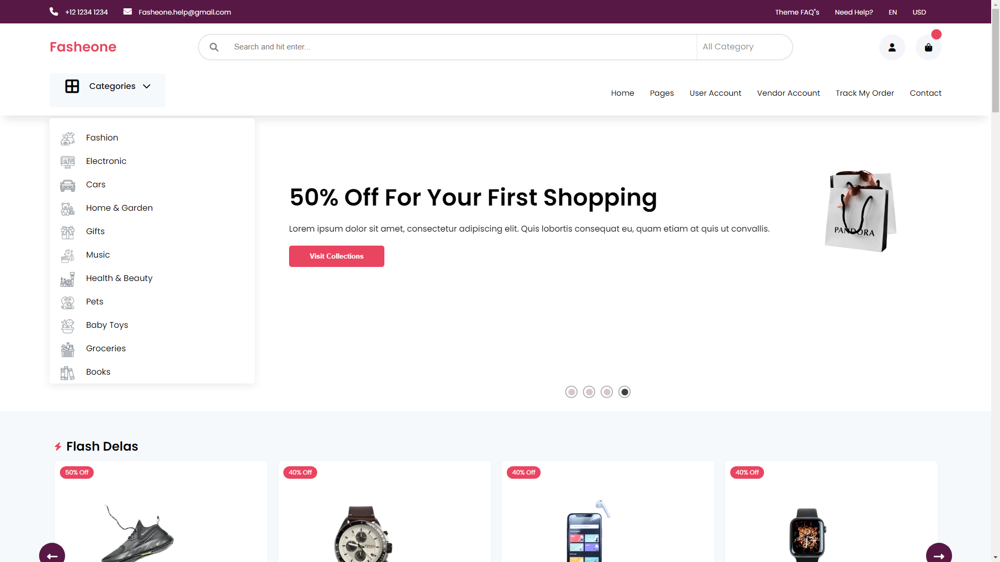
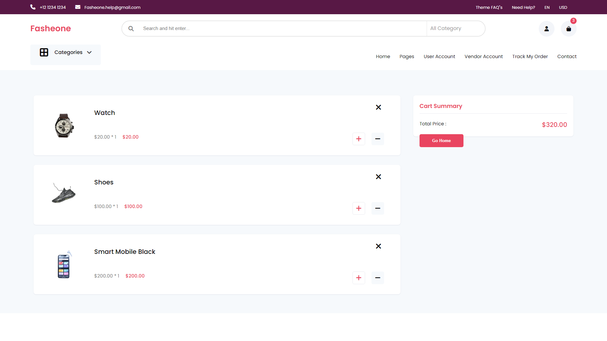
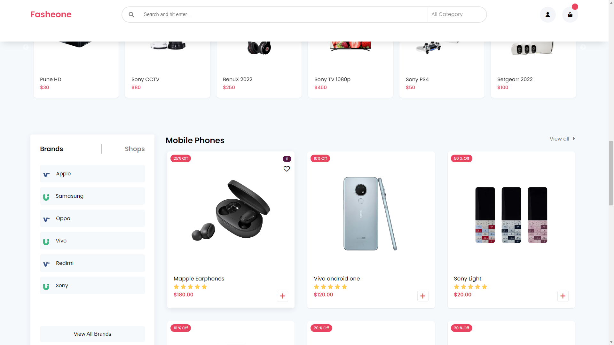
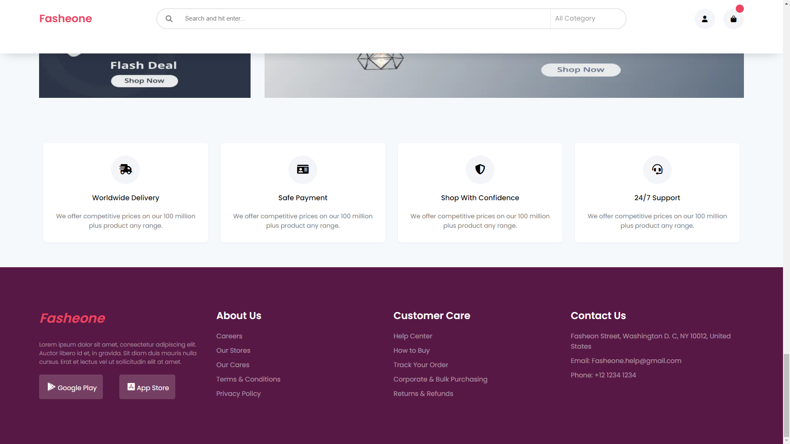

# Fasheone

Podras ejecutar este proyecto con los siguientes comandos en consola, `npm install` (instalar dependecias) luego `npm start` (levantar proyecto). 

### Fasheone es un template de e-commerce.

---

### En el inicio podemos observar un carrucel de ofertas.

### De esta forma se seleccionan los productos.

### Al seleccionar los productos a comprar se pondran en el carro, el cual podemos seguir añadiendo mas de los mismos o quitarlos del carro.

### Tambíen tiene varias secciones las cuales dividen los productos para una fácil busqueda de ellos.

### Cuenta con un cartel de ofertas y con una aplia cantidad de productos en descuento.

### Debajo de la página tenemos nuestas características como empresa y métodos para contactarnos.

